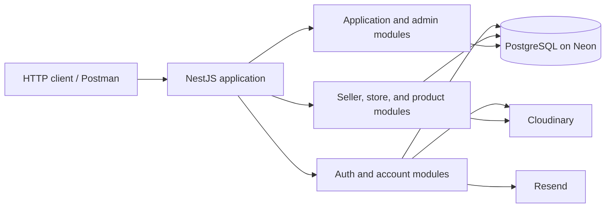
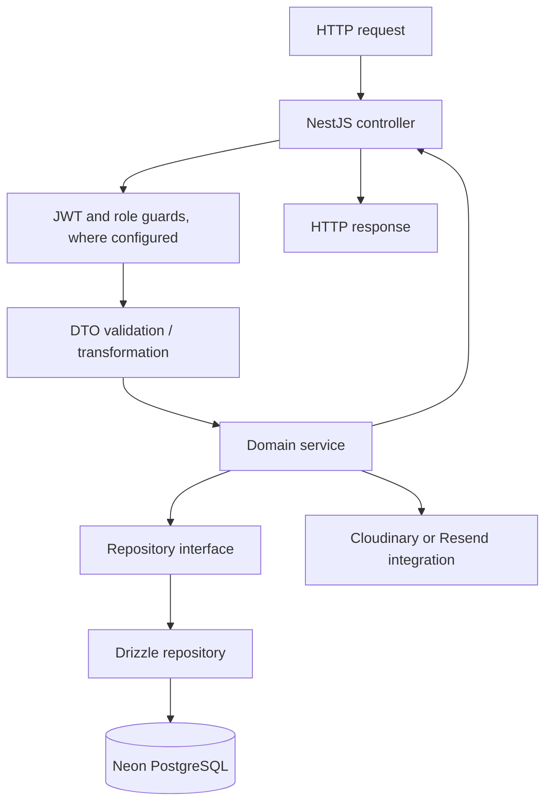
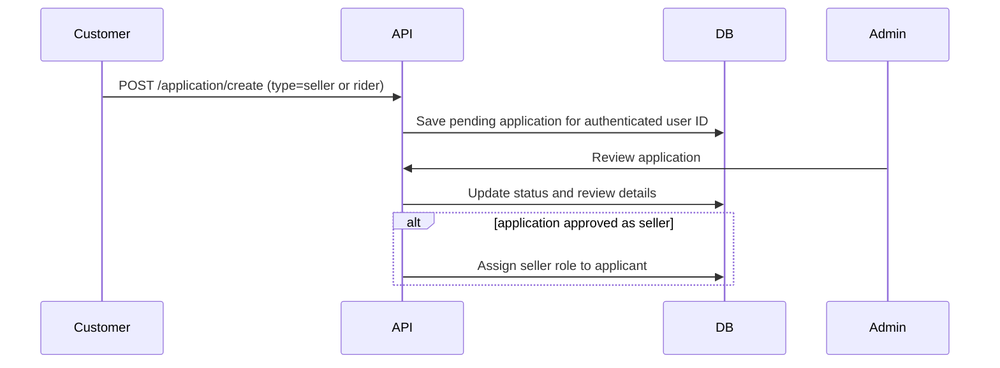
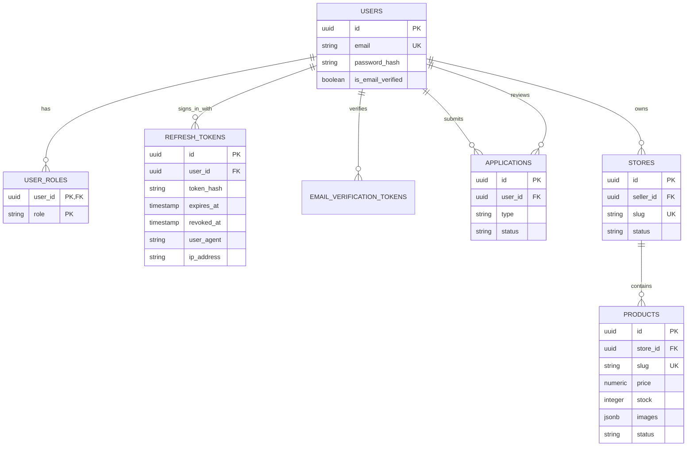

# Architecture

This document describes the backend as it is currently implemented. The
application is a modular NestJS API with PostgreSQL persistence, external
Cloudinary image storage, and Resend email delivery.

## System view



## Application composition

`AppModule` loads environment configuration and composes the database, auth,
Cloudinary, Resend, application, admin, and seller modules. `DatabaseModule` is
global and provides the Neon-backed Drizzle client and role reader.

At startup, `main.ts` installs cookie parsing and a global `ValidationPipe`
with transformation enabled. Controllers bind HTTP routes and DTOs; services
hold business rules; repository interfaces isolate services from Drizzle
queries; repository implementations persist through the shared database
service.



## Modules and responsibilities

| Area | Responsibility |
| --- | --- |
| `common` | Current-user decorator, JWT and role guards, shared role and JWT types |
| `auth` | Signup, email verification, login, refresh-token rotation, logout |
| `users` | Own profile, password, sessions, account deletion, and admin user lookups |
| `application` | Submit a request for seller or rider access |
| `admin` | Review applications and grant the seller role when approved |
| `seller/store` | Create and manage stores and their Cloudinary images |
| `seller/product` | Create and manage products, inventory fields, and product images |
| `infrastructure/database` | Drizzle schemas and implementations of persistence interfaces |
| `infrastructure/cloudinary` | Upload and delete image assets |
| `infrastructure/resend` | Send email-verification messages |

`SellerController` is currently an empty placeholder. Store and product routes
are implemented in their respective controllers.

## Authentication and authorization flow

1. Signup stores the user with a bcrypt password hash and sends an email
   verification link through Resend.
2. Email verification marks the account verified and assigns the `customer`
   role.
3. Login returns a signed JWT access token and sets a signed refresh token in
   an HTTP-only cookie. The database stores a bcrypt hash of the refresh token,
   plus session timestamps and available user-agent/IP metadata.
4. Refresh verifies the refresh token, rotates it, and revokes the previous
   database record. Logout revokes the current refresh token.
5. `JwtAuthGuard` verifies access tokens and attaches the JWT payload to the
   request. `RoleGuard` reads route role metadata and checks the user's roles
   through the role-reader interface.

Roles are `customer`, `seller`, `rider`, and `admin`. A user can have more than
one role. Seller and rider roles are requested through applications; the
current admin approval flow grants the seller role for an approved
application.

## Account lifecycle

Account routes are protected by JWT and role guards. Users can read and edit
their own profiles, remove their profile image, change their password, inspect
or revoke refresh-token sessions, and delete their account after confirming
their password. Password changes revoke refresh-token sessions. Account
deletion cascades through related database rows and attempts to remove owned
profile/store/product media from Cloudinary.

Admin-only user routes list users and read a user by UUID. These return safe
user profiles with roles rather than password hashes.

## Seller application and ownership lifecycle



Seller ownership is represented by foreign keys and checked in services:

```text
users.id
  └── stores.seller_id
        └── products.store_id
```

Store operations that modify data verify the signed-in seller owns the store.
Product operations resolve the product's store and verify that store belongs
to the signed-in seller. Store deletion cascades to products in PostgreSQL.

## Persistence model



Product image files live in Cloudinary. The product row stores a JSONB array of
image metadata (`url`, `publicId`, and `displayOrder`). Store and profile image
URLs and Cloudinary public IDs are stored in their owning rows.

Drizzle definitions live in `src/infrastructure/database/schema/`; migrations
are in `drizzle/`. Repositories live under
`src/infrastructure/database/repositories/` and implement interfaces owned by
the feature modules.

## Image and seed data flow

For API product creation, the product upload interceptor accepts one to ten
images, uploads each file to Cloudinary, and places the returned URLs and
public IDs into the validated request data. The product service applies the
minimum-one-image rule and saves the product metadata in PostgreSQL. Store and
profile image uploads follow the same external-upload-then-save-metadata
pattern.

The development seed at
`src/infrastructure/database/seeds/realistic.seed.ts` reads product JSON
definitions, creates users and roles, creates stores using returned seller IDs,
then creates products using returned store IDs. By default it uses the single
Git-ignored `shared-product.png` file and uploads one independent Cloudinary
copy for each product record. A product-specific `product.png` can override the
shared image. Seed validation and cleanup commands are documented in the seed
README.

## Current scope and next layers

Implemented functionality covers authentication, account management, seller
applications and review, stores, and seller-managed products. Routes for
customer-facing public catalog browsing, pagination, filtering, sorting, carts,
checkout, orders, delivery addresses, wishlists, and product reviews are not
present in the current codebase.
