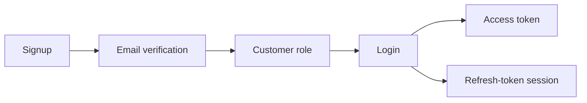
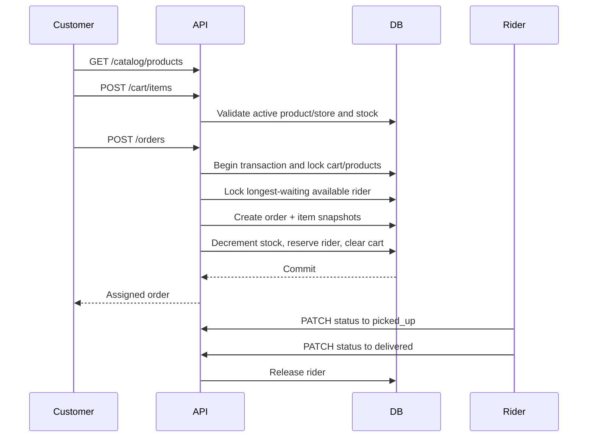
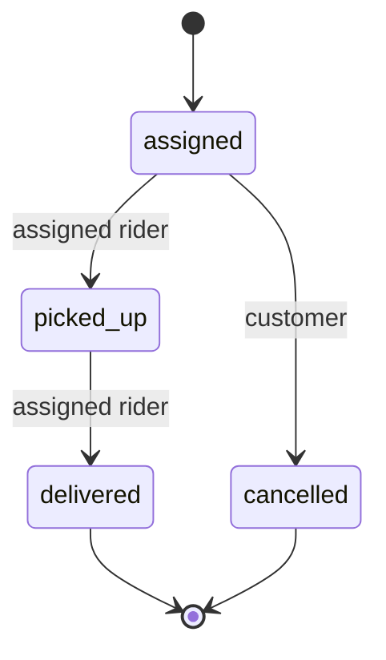

# Business Flows

## Customer account lifecycle

Signup creates an unverified account. Verification activates the account and
assigns its initial customer role. Login then creates an access token and a
rotatable refresh-token session. Users can edit their profile, change their
password, inspect sessions, revoke sessions, or delete the account.

## Becoming a seller

1. An authenticated customer submits a `seller` application.
2. An administrator lists pending applications.
3. Approval records the reviewer and adds the seller role.
4. The role guard sees the new database role immediately.
5. The seller creates stores and uploads store images.
6. The seller creates products only inside stores they own.
7. Active products in active stores become visible through the public catalog.

Seller access and ownership are distinct. The seller role permits use of
seller routes; ownership checks determine which stores and products that seller
may mutate.

## Becoming a rider

1. An authenticated customer submits a `rider` application.
2. An administrator approves it and adds the rider role.
3. The rider creates one vehicle profile.
4. Motor vehicles require plate and license numbers; bicycles do not.
5. The rider sets availability to `true` when ready for assignment.
6. A rider with an active assigned or picked-up order cannot manually become
   available.

## Catalog, cart, and checkout

Cart rows are mutable and always display the current product price. Checkout
revalidates product/store status and stock, calculates totals on the server,
and creates immutable snapshots. Clients cannot submit prices or select a
rider. The demo delivery fee is fixed at `5.00`.

Rider assignment is FIFO by `rider_profiles.updated_at`, not geographic. This
keeps the demo focused on transactions, locks, authorization, and state
transitions without a location subsystem.

## Order state machine

- Only the assigned rider can update fulfillment status.
- Only `assigned -> picked_up -> delivered` is valid for rider updates.
- A customer can cancel only an `assigned` order.
- Delivery and cancellation release the rider.
- Cancellation restores stock for order products that still exist.
- Optimistic conditions return a conflict when another request changes the
  order first.

## Reviews

1. Anyone can read reviews and rating summaries for a product.
2. An authenticated user can review an active product in an active store.
3. The database permits one review per user/product pair.
4. The author can update rating, title, or comment.
5. The author can delete the review.

Product review lists support rating filters and sorting, while their summary
remains unfiltered so the average and star distribution describe the entire
product.

## Account deletion

Account deletion requires password confirmation. The service revokes sessions,
deletes disposable related data through foreign-key cascades, and attempts to
remove owned Cloudinary images.

Historical orders remain. The deleted customer's reference becomes null, and
order item snapshots continue to describe what was purchased. This separates
account privacy/deletion from operational history.
