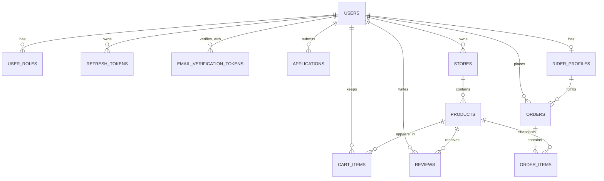

# Database

## Technology and access boundary

PostgreSQL is hosted through Neon. Runtime access uses Drizzle's
`neon-serverless` adapter with a WebSocket pool, which supports the checkout
and cancellation transactions used by the order repository.

Feature services do not import Drizzle schemas or `DatabaseService`. They
depend on feature-owned repository interfaces; concrete Drizzle repositories
live under `src/infrastructure/database/repositories/`.

## Tables

| Table                       | Responsibility                     | Important constraints                                                          |
| --------------------------- | ---------------------------------- | ------------------------------------------------------------------------------ |
| `users`                     | Account identity and profile       | Unique email; password hash required                                           |
| `user_roles`                | Many-to-many user role assignments | Composite primary key `(user_id, role)`                                        |
| `refresh_tokens`            | Hashed refresh-token sessions      | Belongs to a user; supports expiration and revocation                          |
| `email_verification_tokens` | Email-verification state           | Belongs to a user                                                              |
| `applications`              | Seller/rider access requests       | Type/status enums; indexed by user, type, and status                           |
| `stores`                    | Seller-owned storefronts           | Unique slug; cascades when seller is deleted                                   |
| `products`                  | Store-owned catalog inventory      | Unique slug; exact numeric price; product status enum                          |
| `cart_items`                | Per-user mutable cart              | Composite key for user/product; positive quantity handled by application rules |
| `reviews`                   | User-authored product reviews      | Rating check `1..5`; unique `(product_id, user_id)`                            |
| `rider_profiles`            | Rider vehicle and availability     | One profile per user; unique plate/license identifiers                         |
| `orders`                    | Checkout and fulfillment record    | Status enum; address and monetary snapshot; nullable historical references     |
| `order_items`               | Checkout-time product snapshots    | Cascades with order; product reference may become null                         |

## Relationships



## Domain statuses

```text
Application: pending | approved | rejected
Store:       draft | active | inactive
Product:     draft | active | inactive
Order:       assigned | picked_up | delivered | cancelled
Vehicle:     bicycle | motorcycle | car | van
```

Exact enum definitions remain in the feature domain and are reused by the
Drizzle schema, preventing persistence types from defining business contracts.

## Delete behavior and history

- Deleting a user cascades their roles, tokens, applications, carts, reviews,
  stores, products, and rider profile where applicable.
- Deleting a store cascades its products.
- Deleting a product cascades cart items and reviews.
- Deleting an order cascades its item snapshots.
- `orders.user_id` uses `ON DELETE SET NULL` so account deletion anonymizes but
  does not erase order history.
- `orders.rider_profile_id` and `order_items.product_id` also use
  `ON DELETE SET NULL`.
- Order items preserve product name, image, unit price, quantity, and line
  total even when the live product disappears.

Cloudinary assets are outside PostgreSQL. Services attempt to remove owned
remote images during replacement or deletion; database foreign keys cannot
enforce remote cleanup.

## Checkout transaction

Checkout is the most important transaction boundary:

1. Lock the customer's cart rows and joined products.
2. Reject empty carts, unavailable products/stores, or insufficient stock.
3. Select the longest-waiting available rider and lock it with `SKIP LOCKED`.
4. Insert the order and immutable order items.
5. Decrement product stock with a guarded condition.
6. Mark the selected rider unavailable.
7. Delete the customer's cart rows.
8. Commit all changes together.

Row locks prevent concurrent checkouts from assigning the same rider. The
stock condition detects a race before inventory can become negative.

Cancellation is also transactional: it changes an `assigned` order to
`cancelled`, restores stock for products that still exist, and releases the
rider.

## Migrations

Schemas are exported from
`src/infrastructure/database/schema/index.ts`. Drizzle Kit reads that entry
point through `drizzle.config.ts` and writes SQL plus snapshots under
`drizzle/`.

```bash
pnpm db:generate
pnpm db:migrate
```

Recommended workflow:

1. Change the relevant schema definition.
2. Generate a migration.
3. Review generated SQL, especially nullability, defaults, foreign keys, and
   delete actions.
4. Apply the migration to a development database.
5. Build and exercise the affected API flow.

Do not edit an already-applied migration merely to change current behavior;
create a new migration so other databases have a reproducible history.
